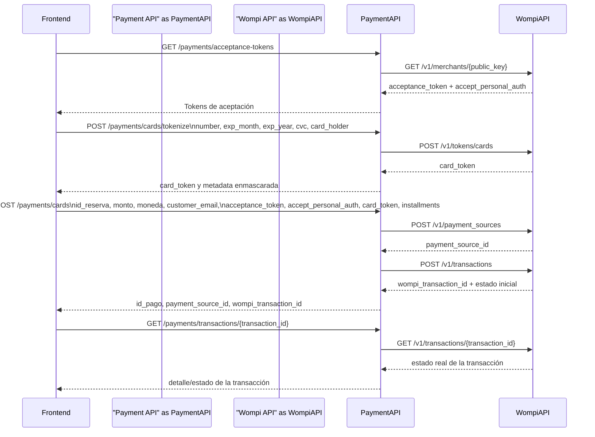

# Payment Service

## Prueba local con tarjeta sandbox sin webhook real

Este flujo prueba el backend local de `payment` contra Wompi Sandbox usando tarjeta tokenizada. La validación final se hace consultando el estado de la transacción en Wompi con `GET /payments/transactions/{transaction_id}`.

### Requisitos

- Tener `.venv` creado en `Backend/payment/.venv`
- Tener el archivo `.env` con valores sandbox:
  - `WOMPI_PUBLIC_KEY=pub_test_...`
  - `WOMPI_PRIVATE_KEY=prv_test_...`
  - `WOMPI_INTEGRITY_SECRET=test_integrity_...`
  - `WOMPI_EVENTS_SECRET=test_events_...`

### Arranque local

Desde `Backend/payment`:

```powershell
.\scripts\start-local.ps1
```

El script:

- carga `.env` en la sesión actual
- valida las variables Wompi requeridas
- arranca `uvicorn` en `http://127.0.0.1:8000`

### Caso feliz

En otra terminal, desde `Backend/payment`:

```powershell
.\scripts\test-card-payment.ps1
```

Ese script ejecuta este flujo:

1. `GET /health`
2. `GET /payments/acceptance-tokens`
3. `POST /payments/cards/tokenize`
4. `POST /payments/cards`
5. `GET /payments/{id_pago}`
6. `GET /payments/transactions/{transaction_id}`

Tarjeta de aprobación usada por defecto:

- `4242424242424242`

### Caso de rechazo

```powershell
.\scripts\test-card-payment.ps1 -Decline
```

Tarjeta de rechazo usada por el script:

- `4111111111111111`

### Personalización

Puedes cambiar parámetros sin editar el script:

```powershell
.\scripts\test-card-payment.ps1 `
  -ReservationId "reserva-prueba-002" `
  -Amount 180000 `
  -CustomerEmail "sandbox@travelhub.com" `
  -Installments 2
```

### Notas

- Este flujo no depende de webhook real.
- Wompi no puede notificar a `localhost`, así que la confirmación se hace por polling al endpoint `GET /payments/transactions/{transaction_id}`.
- Si quieres probar la actualización interna por webhook, usa el script existente `scripts/simulate_wompi_webhook.py`.

## Flujo de tokenización y pago



Wompi es quien genera el `card_token`; el servicio `payment` no tokeniza localmente ni persiste datos sensibles de tarjeta.  
El frontend envía al backend los datos de tarjeta para tokenización y luego solicita el pago usando `card_token`, `acceptance_token` y `accept_personal_auth`.  
Wompi devuelve primero el `card_token`, luego el `payment_source_id`, y finalmente el `wompi_transaction_id` y el estado de la transacción.  
El servicio `payment` persiste `payment_source_id`, `wompi_transaction_id` y metadatos del pago, pero no persiste `card_token`.  
Este diagrama cubre únicamente el flujo de tarjeta tokenizada. No incluye widget checkout, webhook real ni actualización asíncrona por `transaction.updated`.
